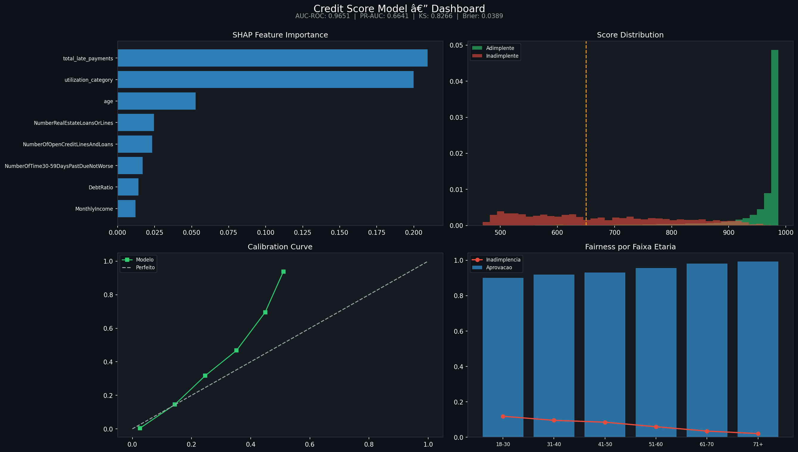
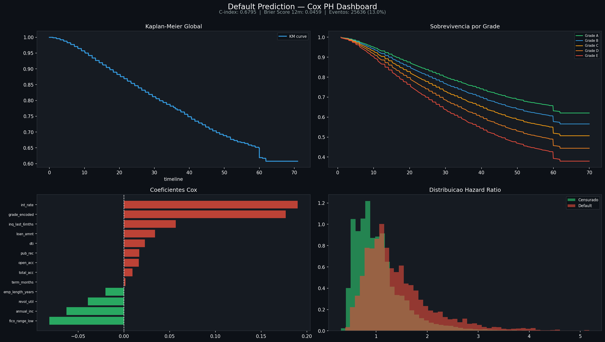

# Fintech Risk Framework

> Portfolio de Data Science aplicado ao setor financeiro — modelos de risco, segmentacao e deteccao de anomalias em producao, todos seguindo Clean Architecture.


---

## Projetos

| # | Projeto | Tecnica | Diferencial | Metrica | Status |
|---|---------|---------|-------------|---------|--------|
| 1 | [Credit Card Fraud Detection](#1-credit-card-fraud-detection) | Autoencoder + XGBoost | Pipeline hibrido unsupervised + supervised | PR-AUC 0.8665 | ✅ Concluido |
| 2 | [Customer Segmentation](#2-customer-segmentation) | K-Means + UMAP + RFM | Visualizacao 2D de alta dimensao | Silhouette 0.4271 | ✅ Concluido |
| 3 | [Credit Score](#3-credit-score) | LightGBM + SHAP | Explicabilidade regulatoria + fairness | AUC-ROC 0.9651 | ✅ Concluido |
| 4 | [Default Prediction](#4-default-prediction) | Survival Analysis (Cox PH) | Modelagem de tempo ate o evento | C-index 0.6795 | ✅ Concluido |

---

## Arquitetura

Todos os projetos seguem Clean Architecture com a mesma regra de dependencia:

```
api → use_cases → domain ← infrastructure
```

```
src/
├── domain/          # Entidades e contratos — zero dependencias externas
├── use_cases/       # Regras de negocio — orquestra sem conhecer frameworks
├── infrastructure/  # PyTorch, XGBoost, LightGBM, lifelines — implementacoes concretas
└── api/             # FastAPI, Pydantic, injecao de dependencia
```

---

## Compatibilidade

| Sistema | Suporte | Ativacao do ambiente virtual |
|---------|---------|------------------------------|
| Windows | ✅ | `.venv\Scripts\Activate.ps1` |
| Linux | ✅ | `source .venv/bin/activate` |
| macOS | ✅ | `source .venv/bin/activate` |

Todo o codigo Python e cross-platform. O pipeline de ML e a API rodam identicamente em qualquer OS.

---

## 1. Credit Card Fraud Detection

Pipeline hibrido de deteccao de fraude em tempo real combinando **Anomaly Detection** (Autoencoder PyTorch) e **classificacao supervisionada** (XGBoost + SMOTE).

### Dashboard


### O problema

Com apenas **0,17% de fraudes** no dataset, um modelo que classifica tudo como legitimo acerta 99,83% das vezes — e e completamente inutil.

| Desafio | Solucao |
|---------|---------|
| Desbalanceamento extremo (0,17%) | SMOTE + `scale_pos_weight` no XGBoost |
| Fraudes sem padrao supervisionado | Autoencoder treinado so com transacoes legitimas |
| Threshold padrao 0.5 inadequado | Calibracao via curva Precision-Recall |
| Latencia < 50ms | Pipeline otimizado em memoria |

### Pipeline

```
Transacao → StandardScaler → Autoencoder → reconstruction_error
                                                    ↓
                             XGBoost([30 features + reconstruction_error])
                                                    ↓
                                          FraudPrediction
```

### Resultados

| Modelo | PR-AUC |
|--------|--------|
| Baseline aleatorio | 0.0017 |
| Logistic Regression | ~0.62 |
| Random Forest | ~0.78 |
| XGBoost + SMOTE | ~0.84 |
| **Autoencoder + XGBoost (este projeto)** | **0.8665** |

### API

```bash
curl -X POST http://localhost:8000/predict \
  -H "Content-Type: application/json" \
  -d '{"Time": 406.0, "Amount": 2125.87, "V1": -3.04, ...}'

# Resposta
{
  "fraud_probability": 0.9231,
  "is_fraud": true,
  "risk_label": "HIGH",
  "reconstruction_error": 0.847,
  "latency_ms": 12.4
}
```

### Como executar

```bash
pip install -r requirements.txt

# Windows: $env:PYTHONPATH = "src"
# Linux/macOS: export PYTHONPATH=src

python scripts/train_autoencoder.py
python scripts/train_classifier.py
uvicorn api.main:app --reload --port 8000
pytest tests/test_fraud_detection.py -v   # 14 testes
```

---

## 2. Customer Segmentation

Segmentacao de clientes usando **K-Means + UMAP** sobre features **RFM** (Recency, Frequency, Monetary) extraidas do dataset Online Retail UCI (541k transacoes, 5.819 clientes).

### Dashboard


### O problema

Nem todo cliente e igual. Um banco ou fintech precisa saber quem sao seus **Champions**, quem esta **At Risk** e quem e **Lost** para agir diferente com cada grupo.

| Desafio | Solucao |
|---------|---------|
| Outliers extremos em valor monetario | RobustScaler (resistente a outliers vs StandardScaler) |
| Numero de clusters | KMeans com 5 clusters otimizados por Silhouette Score |
| Alta dimensao dificil de visualizar | UMAP reduz para 2D mantendo estrutura de vizinhanca |
| Labels sem significado de negocio | Mapeamento automatico por valor monetario medio |

### Resultados

| Metrica | Valor |
|---------|-------|
| Silhouette Score | **0.4271** |
| Clientes segmentados | 5.819 |
| Clusters | 5 |
| Dataset | Online Retail UCI (2009-2011) |

### Segmentos

| Segmento | Perfil RFM | Acao de negocio |
|----------|-----------|-----------------|
| Champions | Baixo recency, alta freq, alto monetary | Programa de fidelidade VIP |
| Loyal Customers | Frequencia alta, valor medio | Upsell / cross-sell |
| At Risk | Alto recency, bom historico | Campanha de reativacao urgente |
| New Customers | Baixo recency, baixa freq | Onboarding e educacao |
| Lost | Alto recency, baixo valor | Desconto agressivo ou abandono |

### Como executar

```bash
cd customer-segmentation
pip install -r requirements.txt

# Windows: $env:PYTHONPATH = "src"
# Linux/macOS: export PYTHONPATH=src

python scripts/train_segmentation.py --data data/raw/online_retail.csv
uvicorn api.main:app --reload --port 8001
pytest tests/ -v   # 13 testes
```

---

## 3. Credit Score

Modelo de credit scoring com **LightGBM + Platt calibration + SHAP** e analise de vies algoritmico por faixa etaria. Dataset Give Me Some Credit (150k clientes, Kaggle).

### Dashboard



### O problema

Credit scoring requer mais do que boa performance — reguladores exigem **probabilidades calibradas** e **explicabilidade por cliente**.

| Desafio | Solucao |
|---------|---------|
| 19.8% de nulls em MonthlyIncome | Imputacao por mediana da faixa etaria |
| Outliers extremos (DebtRatio ate 329k) | Clip por percentil 99 + feature derivada |
| Probabilidades descalibradas | Platt scaling (CalibratedClassifierCV) |
| Explicabilidade regulatoria | SHAP TreeExplainer — top 3 fatores por cliente |
| Vies algoritmico por idade | Fairness analysis por faixa etaria |

### Resultados

| Metrica | Valor | Benchmark de mercado |
|---------|-------|---------------------|
| AUC-ROC | **0.9651** | > 0.75 bom |
| PR-AUC | **0.6641** | > 0.40 bom para 6.7% default |
| KS Statistic | **0.8266** | > 0.40 excelente |
| Brier Score | **0.0389** | < 0.10 bem calibrado |

### Fairness Analysis

| Faixa etaria | Aprovacao | Inadimplencia real |
|---|---|---|
| 18-30 | 90.1% | 11.9% |
| 31-40 | 91.9% | 9.6% |
| 41-50 | 93.2% | 8.5% |
| 51-60 | 95.5% | 5.9% |
| 61-70 | 98.1% | 3.5% |
| 71+ | 99.3% | 2.1% |

> Taxas de aprovacao consistentes com inadimplencia real — sem vies discriminatorio por idade.

### Score e Grades

| Grade | Score | Recomendacao |
|-------|-------|--------------|
| A | 800-1000 | APPROVE |
| B | 650-799 | APPROVE |
| C | 500-649 | REVIEW |
| D | 350-499 | REVIEW |
| E | 0-349 | DENY |

### Como executar

```bash
cd credit-score
pip install -r requirements.txt

# Windows: $env:PYTHONPATH = "src"
# Linux/macOS: export PYTHONPATH=src

python scripts/train_credit_score.py --data data/raw/cs-training.csv
uvicorn api.main:app --reload --port 8002
pytest tests/ -v   # 14 testes
```

---

## 4. Default Prediction

Modelo de **Survival Analysis** usando **Cox Proportional Hazards** para prever quando (nao apenas se) um emprestimo vai entrar em default. Dataset Lending Club (2.2M emprestimos, 2007-2018).

### Dashboard



### O problema

Classificacao binaria responde "este emprestimo vai dar default?" — mas gestores de risco precisam saber **quando**: qual a probabilidade de default nos proximos 12, 24 ou 36 meses? Survival Analysis modela o tempo ate o evento, nao apenas sua ocorrencia.

| Desafio | Solucao |
|---------|---------|
| Dados censurados (emprestimos ainda ativos) | Cox PH trata censura diretamente — classificadores ignoram |
| Definicao de evento vs. censura | Charged Off + Default + Late 31-120d = evento; resto = censurado |
| Duracao variavel por emprestimo | `duration_months` calculado entre `issue_d` e `last_pymnt_d` |
| Volume (2.2M linhas) | Amostra estratificada de 200k mantendo proporcao de eventos |

### Pipeline

```
CSV Lending Club → LendingClubProcessor → duration_months + event
                                                    ↓
                              StandardScaler → CoxPHFitter(penalizer=0.1)
                                                    ↓
                         predict_survival_function(t=[12, 24, 36])
                                                    ↓
                    DefaultPrediction(survival_at_12m, hazard_ratio, risk_tier)
```

### Resultados

| Metrica | Valor | Interpretacao |
|---------|-------|---------------|
| **C-index** | **0.6795** | > 0.65 util em credito |
| **Brier Score 12m** | **0.0459** | Excelente calibracao |
| Eventos (default) | 13% | Dataset bem representado |
| Convergencia | 5 iteracoes | Modelo estavel |

### Coeficientes Cox — Fatores de Risco

| Feature | Coef | Interpretacao |
|---------|------|---------------|
| `int_rate` | +0.19 | Taxa alta aumenta risco |
| `grade_encoded` | +0.18 | Grade pior aumenta risco |
| `inq_last_6mths` | +0.06 | Consultas de credito aumentam risco |
| `fico_range_low` | -0.08 | FICO alto reduz risco |
| `annual_inc` | -0.06 | Renda alta protege contra default |
| `emp_length_years` | -0.02 | Mais tempo empregado reduz risco |

### API

```bash
curl -X POST http://localhost:8003/predict \
  -H "Content-Type: application/json" \
  -d '{
    "loan_id": "L001",
    "loan_amnt": 15000,
    "int_rate": 13.99,
    "grade": "C",
    "emp_length_years": 5,
    "annual_inc": 65000,
    "dti": 18.5,
    "fico_range_low": 690,
    "open_acc": 10,
    "revol_util": 45,
    "total_acc": 25,
    "inq_last_6mths": 1,
    "pub_rec": 0,
    "term_months": 36
  }'

# Resposta
{
  "survival_at_12m": 0.9231,
  "survival_at_24m": 0.8654,
  "survival_at_36m": 0.8102,
  "median_survival_months": 48.0,
  "hazard_ratio": 0.92,
  "risk_tier": "LOW",
  "pd_12m": 0.0769,
  "latency_ms": 22.1
}
```

| risk_tier | pd_12m | Interpretacao |
|-----------|--------|---------------|
| `LOW` | < 5% | Risco baixo |
| `MEDIUM` | 5-15% | Monitorar |
| `HIGH` | 15-30% | Revisao manual |
| `VERY_HIGH` | > 30% | Alto risco |

### Como executar

```bash
cd default-prediction
pip install -r requirements.txt

# Windows: $env:PYTHONPATH = "src"
# Linux/macOS: export PYTHONPATH=src

python scripts/train_default.py --data data/raw/lending_club.csv
uvicorn api.main:app --reload --port 8003
pytest tests/ -v   # 14 testes
```

---

## Stack tecnologico

| Categoria | Tecnologias |
|-----------|-------------|
| ML / DL | PyTorch, XGBoost, LightGBM, scikit-learn, SHAP, UMAP, lifelines |
| API | FastAPI, Pydantic, Uvicorn |
| Tracking | MLflow |
| Testes | pytest, 55 testes automatizados |
| Infra | Docker multi-stage, venv |
| Arquitetura | Clean Architecture (domain / use_cases / infrastructure / api) |
| OS | Windows, Linux, macOS |

---

## O que esse portfolio demonstra

- **Clean Architecture aplicada a ML** — separacao real entre dominio, casos de uso, infraestrutura e API
- **Tratamento de desbalanceamento extremo** — SMOTE, threshold calibrado por PR-AUC, `scale_pos_weight`
- **Anomaly detection** com Autoencoder como feature engineering para modelo supervisionado
- **RFM + clustering** — padrao da industria financeira para segmentacao de clientes
- **UMAP para visualizacao** — reducao de alta dimensao mantendo estrutura de vizinhanca
- **Calibracao de probabilidade** (Platt scaling) — requisito regulatorio em credit scoring
- **Explicabilidade por cliente** com SHAP TreeExplainer — top 3 fatores por decisao
- **Fairness analysis** — deteccao de vies algoritmico por faixa etaria
- **Score 0-1000 com grades A-E** — padrao de mercado financeiro
- **Survival Analysis (Cox PH)** — modela tempo ate o evento, nao apenas classificacao binaria
- **Tratamento de dados censurados** — diferencial tecnico vs. classificadores convencionais
- **APIs de inferencia em tempo real** — latencia < 50ms em todos os projetos
- **55 testes automatizados** cobrindo entidades, casos de uso e endpoints
- **Cross-platform** — Windows, Linux e macOS

---

## Referencias

- Dal Pozzolo, A. et al. (2015). *Calibrating Probability with Undersampling for Unbalanced Classification*. IEEE SSCI.
- McInnes, L. et al. (2018). *UMAP: Uniform Manifold Approximation and Projection*. arXiv:1802.03426.
- Niculescu-Mizil, A. & Caruana, R. (2005). *Predicting Good Probabilities with Supervised Learning*. ICML.
- Cox, D.R. (1972). *Regression Models and Life-Tables*. Journal of the Royal Statistical Society.
- Dataset 1: [ULB Credit Card Fraud](https://www.kaggle.com/datasets/mlg-ulb/creditcardfraud)
- Dataset 2: [Online Retail UCI](https://archive.ics.uci.edu/dataset/352/online+retail)
- Dataset 3: [Give Me Some Credit](https://www.kaggle.com/competitions/GiveMeSomeCredit/data)
- Dataset 4: [Lending Club](https://www.kaggle.com/datasets/wordsforthewise/lending-club)