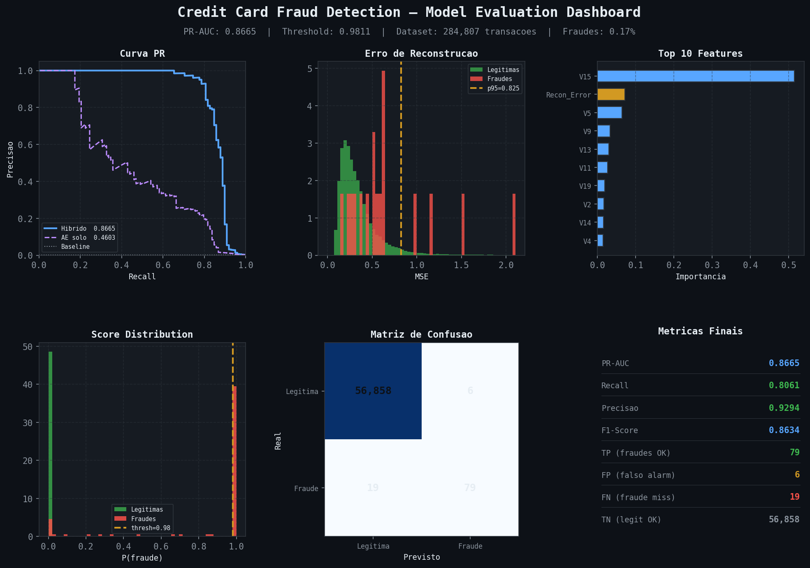
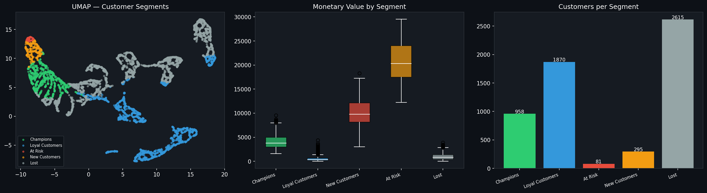

# Fintech Risk Framework

> Portfolio de Data Science aplicado ao setor financeiro — modelos de risco, segmentacao e deteccao de anomalias em producao, todos seguindo Clean Architecture.


---

## Projetos

| # | Projeto | Tecnica | Diferencial | Status |
|---|---------|---------|-------------|--------|
| 1 | [Credit Card Fraud Detection](#1-credit-card-fraud-detection) | Autoencoder + XGBoost | Pipeline hibrido unsupervised + supervised | ✅ Concluido |
| 2 | [Customer Segmentation](#2-customer-segmentation) | K-Means + UMAP + RFM | Visualizacao 2D de alta dimensao | ✅ Concluido |
| 3 | Credit Score | LightGBM + SHAP | Explicabilidade regulatoria, vies algoritmico | 🔜 Em breve |
| 4 | Default Prediction | Survival Analysis (Cox) | Modelagem de tempo ate o evento | 🔜 Em breve |

---

## Arquitetura

Todos os projetos seguem Clean Architecture com a mesma regra de dependencia:

```
api → use_cases → domain ← infrastructure
```

```
src/
├── domain/          # Entidades e contratos — zero dependencias externas
├── use_cases/       # Regras de negocio — orquestra sem conhecer frameworks
├── infrastructure/  # PyTorch, XGBoost, sklearn, MLflow — implementacoes concretas
└── api/             # FastAPI, Pydantic, injecao de dependencia
```

---

## 1. Credit Card Fraud Detection

Pipeline hibrido de deteccao de fraude em tempo real combinando **Anomaly Detection** (Autoencoder PyTorch) e **classificacao supervisionada** (XGBoost + SMOTE).

### Dashboard



### O problema

Com apenas **0,17% de fraudes** no dataset, um modelo que classifica tudo como legitimo acerta 99,83% das vezes — e e completamente inutil.

| Desafio | Solucao |
|---------|---------|
| Desbalanceamento extremo (0,17%) | SMOTE + `scale_pos_weight` no XGBoost |
| Fraudes sem padrao supervisionado | Autoencoder treinado so com transacoes legitimas |
| Threshold padrao 0.5 inadequado | Calibracao via curva Precision-Recall |
| Latencia < 50ms | Pipeline otimizado em memoria |

### Pipeline

```
Transacao → StandardScaler → Autoencoder → reconstruction_error
                                                    ↓
                             XGBoost([30 features + reconstruction_error])
                                                    ↓
                                          FraudPrediction
```

### Resultados

| Modelo | PR-AUC |
|--------|--------|
| Baseline aleatorio | 0.0017 |
| Logistic Regression | ~0.62 |
| Random Forest | ~0.78 |
| XGBoost + SMOTE | ~0.84 |
| **Autoencoder + XGBoost (este projeto)** | **0.8665** |

> **Por que PR-AUC e nao AUC-ROC?** Com 0,17% de fraudes, a AUC-ROC e otimista demais. A PR-AUC mede performance exatamente na classe minoritaria.

### API

```bash
# Predicao unica
curl -X POST http://localhost:8000/predict \
  -H "Content-Type: application/json" \
  -d '{"Time": 406.0, "Amount": 2125.87, "V1": -3.04, ...}'

# Resposta
{
  "fraud_probability": 0.9231,
  "is_fraud": true,
  "risk_label": "HIGH",
  "reconstruction_error": 0.847,
  "latency_ms": 12.4
}
```

| risk_label | Probabilidade | Acao sugerida |
|------------|---------------|---------------|
| `LOW` | < 50% | Aprovar |
| `MEDIUM` | 50–90% | Monitorar |
| `HIGH` | >= 90% | Bloquear |

### Como executar

```bash
# Instalar dependencias
pip install -r requirements.txt

# Treinar
python scripts/train_autoencoder.py
python scripts/train_classifier.py

# API
cd src
uvicorn api.main:app --reload --port 8000

# Testes
$env:PYTHONPATH = "src"
pytest tests/test_fraud_detection.py -v   # 14 testes
```

---

## 2. Customer Segmentation

Segmentacao de clientes usando **K-Means + UMAP** sobre features **RFM** (Recency, Frequency, Monetary) extraidas do dataset Online Retail UCI (541k transacoes, 5.819 clientes).

### Dashboard



### O problema

Nem todo cliente e igual. Um banco ou fintech precisa saber quem sao seus **Champions** (alto valor, compram sempre), quem esta **At Risk** (ja comprou muito mas sumiu) e quem e **Lost** (nunca mais voltou) — para agir diferente com cada grupo.

| Desafio | Solucao |
|---------|---------|
| Outliers extremos em valor monetario | RobustScaler (resistente a outliers vs StandardScaler) |
| Numero de clusters desconhecido | KMeans com 5 clusters otimizados por Silhouette Score |
| Dados de alta dimensao dificeis de visualizar | UMAP reduz para 2D mantendo estrutura de vizinhanca |
| Labels sem significado de negocio | Mapeamento automatico por valor monetario medio |

### Pipeline

```
CSV Online Retail → RFMBuilder → Customer(recency, frequency, monetary)
                                          ↓
                               RobustScaler → KMeans(5) → cluster_id
                                          ↓
                               UMAP(2D) → umap_x, umap_y
                                          ↓
                               CustomerSegment(label, rfm_score, is_high_value)
```

### Resultados

| Metrica | Valor |
|---------|-------|
| Silhouette Score | **0.4271** |
| Clientes segmentados | 5.819 |
| Clusters | 5 |
| Dataset | Online Retail UCI (2009–2011) |

### Segmentos

| Segmento | Perfil RFM | Acao de negocio |
|----------|-----------|-----------------|
| Champions | Baixo recency, alta freq, alto monetary | Programa de fidelidade VIP |
| Loyal Customers | Frequencia alta, valor medio | Upsell / cross-sell |
| At Risk | Alto recency, bom historico | Campanha de reativacao urgente |
| New Customers | Baixo recency, baixa freq | Onboarding e educacao |
| Lost | Alto recency, baixo valor | Desconto agressivo ou abandono |

### API

```bash
# Segmentar um cliente
curl -X POST http://localhost:8000/segment \
  -H "Content-Type: application/json" \
  -d '{"customer_id": "12345", "recency": 30, "frequency": 12, "monetary": 850}'

# Resposta
{
  "cluster_id": 0,
  "segment_label": "Champions",
  "rfm_score": 0.91,
  "umap_x": 3.42,
  "umap_y": -1.87,
  "is_high_value": true
}
```

### Como executar

```bash
cd customer-segmentation

# Instalar dependencias
pip install -r requirements.txt

# Treinar (necessita online_retail_II.csv do Kaggle)
$env:PYTHONPATH = "src"
python scripts/train_segmentation.py --data data/raw/online_retail.csv

# API
uvicorn api.main:app --reload --port 8001

# Testes
pytest tests/ -v   # 13 testes
```

---

## Stack tecnologico

| Categoria | Tecnologias |
|-----------|-------------|
| ML / DL | PyTorch, XGBoost, scikit-learn, UMAP |
| API | FastAPI, Pydantic, Uvicorn |
| Tracking | MLflow |
| Testes | pytest, 41 testes automatizados |
| Infra | Docker multi-stage, .venv |
| Arquitetura | Clean Architecture (domain / use_cases / infrastructure / api) |

---

## O que esse portfolio demonstra

- **Clean Architecture aplicada a ML** — separacao real entre dominio, casos de uso, infraestrutura e API; nenhum arquivo de modelo importa FastAPI, nenhum endpoint conhece XGBoost
- **Tratamento de desbalanceamento extremo** — SMOTE, threshold calibrado por PR-AUC, nao por AUC-ROC
- **Anomaly detection** com Autoencoder como feature engineering para modelo supervisionado
- **RFM + clustering** — padrao da industria financeira para segmentacao de clientes
- **UMAP para visualizacao** — reducao de alta dimensao mantendo estrutura de vizinhanca
- **APIs de inferencia em tempo real** — latencia < 50ms, endpoints `/predict`, `/segment`, `/health`
- **Testes automatizados** cobrindo entidades, casos de uso e endpoints com mocks via `dependency_overrides`
- **Rastreamento de experimentos** com MLflow

---

## Referencias

- Dal Pozzolo, A. et al. (2015). *Calibrating Probability with Undersampling for Unbalanced Classification*. IEEE SSCI.
- McInnes, L. et al. (2018). *UMAP: Uniform Manifold Approximation and Projection*. arXiv:1802.03426.
- Dataset 1: [ULB Credit Card Fraud](https://www.kaggle.com/datasets/mlg-ulb/creditcardfraud)
- Dataset 2: [Online Retail UCI](https://archive.ics.uci.edu/dataset/352/online+retail)