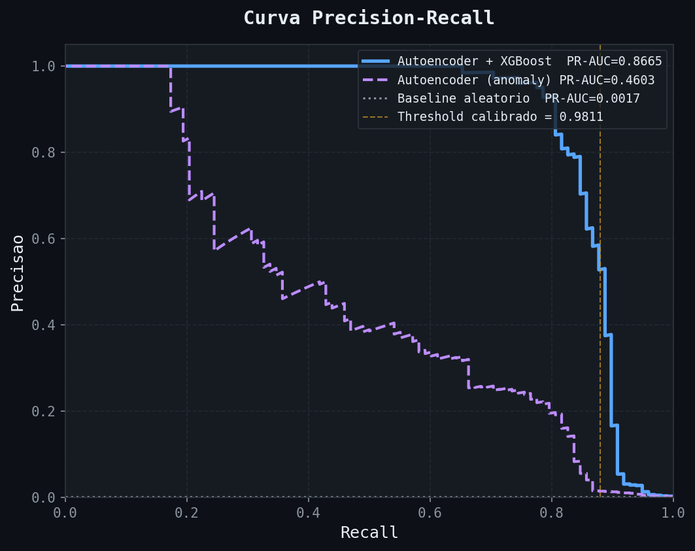
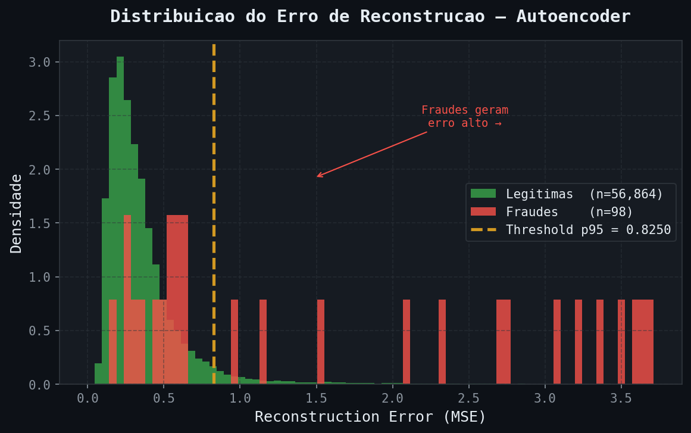
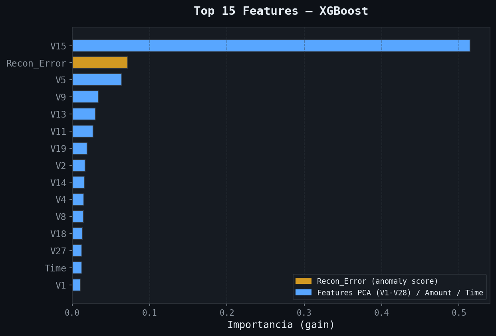
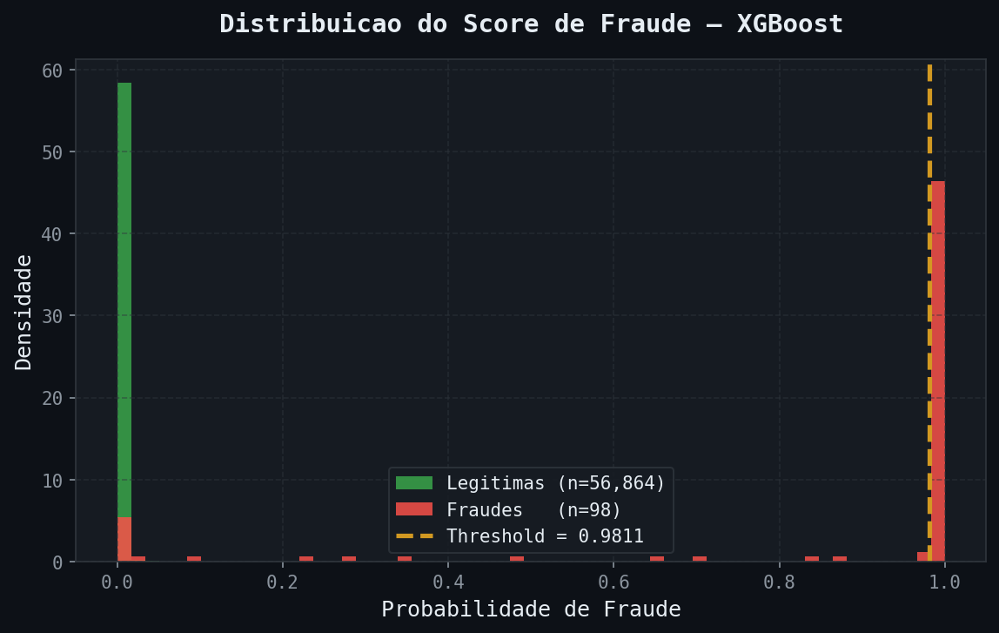

# 💳 Credit Card Fraud Detection

> Pipeline híbrido de detecção de fraude em tempo real combinando **Anomaly Detection** (Autoencoder PyTorch) e **classificação supervisionada** (XGBoost + SMOTE).


---

## 📊 Dashboard de Avaliação


---

## 📌 Contexto do problema

Com apenas **0,17% de fraudes** no dataset, um modelo que classifica tudo como legítimo acerta 99,83% das vezes — e é completamente inútil. Esse projeto ataca exatamente esse problema:

| Desafio | Solução |
|---|---|
| Desbalanceamento extremo (0,17%) | SMOTE + `scale_pos_weight` no XGBoost |
| Fraudes sem padrão supervisionado | Autoencoder treinado só com transações legítimas |
| Threshold padrão 0.5 inadequado | Calibração via curva Precision-Recall |
| Latência < 50ms antes da aprovação | Pipeline otimizado em memória |

---

## 🏗️ Arquitetura

```
Transação → Preprocessor → Autoencoder → XGBoost → Resposta
                                ↓
                        reconstruction_error
                        (anomaly score como feature extra)
```

**Estágio 1 — Autoencoder (unsupervised)**
Treinado apenas com transações legítimas. Aprende o padrão normal.
Fraudes geram alto erro de reconstrução → anomaly score.

**Estágio 2 — XGBoost (supervised)**
Recebe as 30 features originais + `reconstruction_error` como feature extra.
Treinado com SMOTE (fraudes elevadas para 10% do treino).
Threshold calibrado pela curva Precision-Recall — não fixo em 0.5.

---

## 📈 Resultados obtidos

| Modelo | PR-AUC |
|---|---|
| Baseline aleatório | 0.0017 |
| Logistic Regression | ~0.62 |
| Random Forest | ~0.78 |
| XGBoost + SMOTE | ~0.84 |
| **Autoencoder + XGBoost (este projeto)** | **0.8665** |

> **Por que PR-AUC e não AUC-ROC?**
> Com 0,17% de fraudes, a AUC-ROC é otimista demais — um modelo inútil pode ter AUC-ROC de 0.97.
> A PR-AUC mede performance exatamente na classe minoritária, onde importa.

### Curva Precision-Recall



### Distribuição do Erro de Reconstrução

O autoencoder aprende o padrão de transações **legítimas**. Fraudes ficam fora da distribuição aprendida e geram erro alto — esse erro vira uma feature extra para o XGBoost.



### Feature Importance

O `Recon_Error` (anomaly score do autoencoder) aparece entre as features mais importantes do XGBoost, validando a arquitetura híbrida.



### Distribuição do Score de Fraude



---

## 📡 API

Documentação interativa em `http://localhost:8000/docs` após subir a API.

### `POST /predict`

Avalia uma transação antes de aprovar o pagamento. Latência alvo: **< 50ms**.

```bash
curl -X POST http://localhost:8000/predict \
  -H "Content-Type: application/json" \
  -d '{
    "Time": 406.0, "Amount": 2125.87,
    "V1": -3.04, "V2": -3.16, "V3": 1.09, "V4": 2.29, "V5": -3.43,
    "V6": -1.22, "V7": -4.49, "V8": 1.30, "V9": -2.38, "V10": -4.91,
    "V11": 3.26, "V12": -5.26, "V13": -0.01, "V14": -5.26, "V15": 0.02,
    "V16": -1.77, "V17": -8.70, "V18": -0.54, "V19": -0.02, "V20": -0.14,
    "V21": 0.04, "V22": 0.62, "V23": 0.07, "V24": 0.57, "V25": 0.42,
    "V26": -0.03, "V27": 0.32, "V28": 0.04
  }'
```

**Response:**

```json
{
  "fraud_probability": 0.9231,
  "fraud_prediction": true,
  "risk_score": "critical",
  "reconstruction_error": 0.847,
  "model_version": "autoencoder_v1",
  "latency_ms": 12.4
}
```

### `POST /predict/batch`

Processa até 1000 transações em lote.

### `GET /health`

```json
{
  "status": "healthy",
  "models_loaded": true,
  "model_version": "autoencoder_v1",
  "autoencoder_pr_auc": 0.4603,
  "classifier_pr_auc": 0.8665
}
```

### Risk Score

| Score | Probabilidade | Ação sugerida |
|---|---|---|
| `low` | < 30% | Aprovar |
| `medium` | 30–60% | Monitorar |
| `high` | 60–85% | Revisão manual |
| `critical` | > 85% | Bloquear |

---

## 🚀 Como executar

### 1. Clonar e instalar

```bash
git clone https://github.com/Henry3151/Credit-Card-Fraud-Detection.git
cd Credit-Card-Fraud-Detection

python -m venv .venv
# Windows:
.venv\Scripts\Activate.ps1
# Linux/Mac:
source .venv/bin/activate

pip install -r requirements.txt
```

### 2. Dataset

Baixe `creditcard.csv` do [Kaggle](https://www.kaggle.com/datasets/mlg-ulb/creditcardfraud) e coloque em `data/raw/creditcard.csv`.

### 3. Pipeline completo

```bash
# Preparar dados
python src/data/make_dataset.py

# Treinar Autoencoder (anomaly detection)
python src/models/train_autoencoder.py

# Treinar XGBoost Classifier
python src/models/train_classifier.py

# Gerar graficos e logar no MLflow
python src/models/generate_reports.py

# Subir API
uvicorn src.api.main:app --reload --port 8000

# Ver experimentos no MLflow
mlflow ui --port 5000
```

### 4. Testes

```bash
pytest tests/ -v
# 14 passed
```

### 5. Docker

```bash
docker build -t fraud-api .
docker run -p 8000:8000 fraud-api
```

---

## 📁 Estrutura do projeto

```
Credit-Card-Fraud-Detection/
├── data/
│   ├── raw/                    # creditcard.csv (não commitado)
│   └── processed/              # Arrays .npy gerados pelo pipeline
├── models/
│   ├── preprocessor.joblib
│   ├── autoencoder.pt
│   ├── autoencoder_metadata.json
│   ├── classifier.joblib
│   └── classifier_metadata.json
├── notebooks/
│   ├── 01_eda_fraud.ipynb
│   └── 02_model_evaluation.ipynb
├── reports/
│   └── figures/                # Graficos gerados pelo generate_reports.py
│       ├── dashboard.png
│       ├── pr_curve.png
│       ├── reconstruction_error_dist.png
│       ├── feature_importance.png
│       ├── confusion_matrix.png
│       └── score_distribution.png
├── src/
│   ├── api/main.py
│   ├── data/make_dataset.py
│   ├── features/build_features.py
│   └── models/
│       ├── train_autoencoder.py
│       ├── train_classifier.py
│       └── generate_reports.py
├── tests/test_fraud.py
├── Dockerfile
├── ARCHITECTURE.md
├── requirements.txt
└── README.md
```

---

## 🧠 O que esse projeto demonstra

- Tratamento de **desbalanceamento extremo** (0,17%) com SMOTE e threshold calibrado
- **Anomaly detection** com Autoencoder — não só classificação supervisionada
- Diferença prática entre **AUC-ROC e PR-AUC** e quando usar cada uma
- Pensamento em **custo de negócio**: FN = fraude passa, FP = cliente bloqueado
- Arquitetura de **modelo híbrido** (unsupervised + supervised em pipeline)
- API de **inferência em tempo real** com latência < 50ms (FastAPI + PyTorch + XGBoost)
- Pipeline reproduzível com **Docker**
- Rastreamento de experimentos com **MLflow** (métricas, parâmetros e artefatos)
- **14 testes automatizados** cobrindo schema, validação de input e comportamento do modelo

---

## 📚 Referências

- Dal Pozzolo, A. et al. (2015). *Calibrating Probability with Undersampling for Unbalanced Classification*. IEEE SSCI.
- Dataset: [ULB Machine Learning Group](https://www.kaggle.com/datasets/mlg-ulb/creditcardfraud)